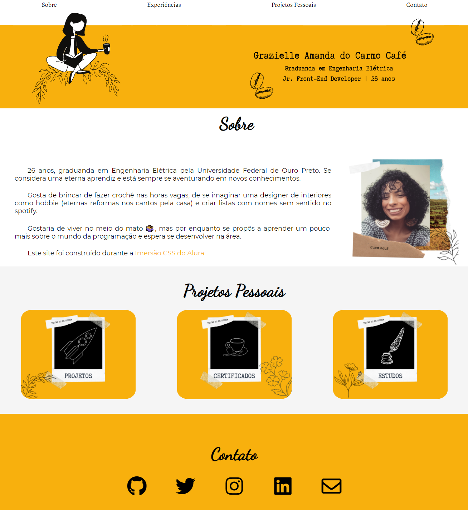

### 1. Landing Page - HTML e CSS
Este projeto consiste em uma landing page responsiva criada utilizando HTML e CSS. A página foi projetada para ser simples e elegante, com foco em uma boa experiência de usuário.

Site pessoal desenvolvido na Imersão Alura - HTML/CSS

 [Clique aqui!](https://graziellecafe.github.io/site-pessoal/)

